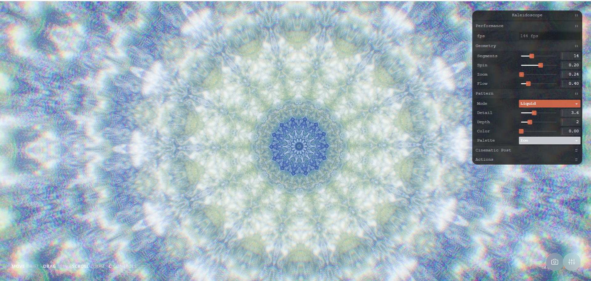

# Kaleidoscope-threejs

A real-time, GPU-powered kaleidoscope built with WebGL shaders (Three.js). Move your mouse to drift the pattern, drag to spin, and scroll to zoom.



## Features

- **Three pattern modes** — Prism (cut-glass voronoi facets), Flower (petal rings), Liquid (domain-warped flowing metal)
- **12 colour palettes** — cycle with arrow keys or the palette dropdown
- **Mouse drift interaction** — moving your cursor gently shifts the kaleidoscope centre for an organic, living feel
- **Post-processing** — bloom, chromatic dispersion, vignette, film grain, saturation
- **Multi-layer parallax** — inter-layer depth creates a subtle 3D tilt as you move
- **Save frame** — exports a full-resolution PNG snapshot

## Controls

| Input | Action |
|---|---|
| Move mouse | Drift / tilt the pattern |
| Drag | Spin |
| Scroll | Zoom in / out |
| `←` / `→` | Previous / next palette |
| `P` | Save frame as PNG |
| `C` | Toggle controls panel |
| `R` | Reset view |

## Running locally

No build step required — open `kaleidoscope.html` directly in any modern browser, or serve it with any static file server:

```bash
# Python
python -m http.server 8080

# Node (npx)
npx serve .
```

Then visit `http://localhost:8080/kaleidoscope.html`.

## Tech

- [Three.js](https://threejs.org/) r160 — WebGL renderer + post-processing
- [Tweakpane](https://tweakpane.github.io/docs/) v4 — controls panel
- [GSAP](https://gsap.com/) 3 — entrance animations
- Pure GLSL fragment shaders — voronoi, FBM, domain warping
